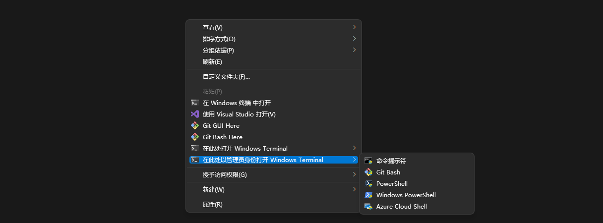

## 将 Windows Terminal 添加到 Windows 右键菜单的 Powershell 脚本

原项目：

[lextm/windowsterminal-shell](https://github.com/lextm/windowsterminal-shell) 

*A project backed by [LeXtudio Inc.](https://www.lextudio.com)* 

感谢原作提供的工具，笔者在这里对其中的内容进行翻译，以及本地化修改。

有时候，我们往往需要在某个目录进入控制台窗口，特别是在某个目录打开管理员窗口，而大多数控制台的默认路径都会从用户家目录出发，不太方便。

此脚本的目的就是为了解决这个问题，实现的效果如下：



### 安装

1. 安装 Window Terminal [Windows Terminal installation | Microsoft Docs](https://github.com/microsoft/terminal)

2. 安装 PowerShell 7  [在 Windows 上安装 PowerShell - PowerShell | Microsoft Docs](https://docs.microsoft.com/zh-cn/powershell/scripting/install/installing-powershell-on-windows)

3. 使用 **管理员权限** 启动 Powershell 7，然后运行仓库中的 `install.ps1` 文件。程序会自动寻找电脑中的终端和 shell 配置，并将其添加到右键菜单。

   > 若要快速运行最新版本的 `install.ps1` 安装脚本，可以将下面的代码复制到 Powershell 7 (管理员权限) 的控制台中运行：
   >
   > ```powershell
   > Set-ExecutionPolicy Bypass -Scope Process -Force; 
   > [System.Net.ServicePointManager]::SecurityProtocol = [System.Net.ServicePointManager]::SecurityProtocol -bor 3072; iex ((New-Object System.Net.WebClient).DownloadString('https://raw.githubusercontent.com/qianfanguojin/windowsterminal-menu/master/install.ps1'))
   > ```
   >
   > 若提示下载失败 `"请求的名称有效，但是找不到请求的类型的数据。 (raw.githubusercontent.com:443)"` 等错误，可以将上面的链接替换为如下的链接，感谢 [@jsdeliver](https://cdn.jsdelivr.net/gh) :
   >
   > ```powershell
   > 'https://cdn.jsdelivr.net/gh/qianfanguojin/windowsterminal-menu/install.ps1'
   > ```
   >
   > 

### 卸载

用和安装同样的方式，运行仓库中的 `unistall.ps1` 脚本来删除右键菜单中的 `在此处打开 Windows Terminal ` 项。

### 注意

安装步骤中的一键安装命令需要从 Github 获取最新的安装的文件，这可能需要你的网络畅通(你懂的) 。

目前的版本只支持在 Windows10/11 电脑上运行，而且要求 Windows Terminal 是通过 Microsoft Store 或者 `.appx` 方式安装的。

安装脚本必须在 **管理员权限** 模式下运行，不知道 Powershell 如何获取管理员权限的请自行百度或谷歌。

从 Microsoft Store 安装的 Powershell 7 不支持此脚本。

`install.ps1` 和 `uninstall.ps1` 仅仅会修改 **当前用户** 的资源管理器右键菜单。如果系统中有多个用户，只有当前登录的用户的右键菜单会被修改。

